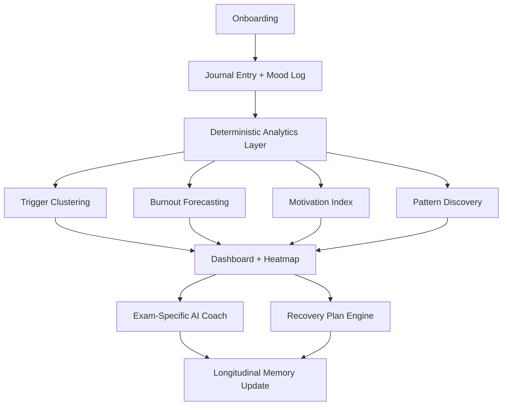
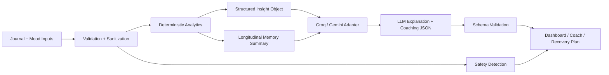

# Architecture and System Design

## Product Vision
Help exam aspirants feel emotionally understood, not merely monitored, by translating daily reflections and mood signals into predictive, personalized, and explainable wellness support.

## User Journey
1. Student selects exam type, stage, exam date, and focus subjects.
2. Student journals and logs mood, sleep, confidence, and study consistency.
3. Analytics engines derive triggers, motivation, patterns, and burnout forecasts.
4. The AI coach explains what matters most and suggests exam-specific next steps.
5. Recovery plans activate when burnout or anxiety signals cross thresholds.

## User Flow Diagram

## Feature Architecture
- **Input layer**: journaling, mood logs, profile context, event tags
- **Deterministic analytics layer**: trigger extraction, burnout scoring, motivation calculation, pattern rules, recovery logic
- **LLM personalization layer**: insight explanation, coaching tone, exam-context adaptation, motivational reframing
- **Presentation layer**: dashboard, analytics, heatmap, coach chat, recovery workspace
- **Safety layer**: schema validation, prompt-injection filtering, crisis-risk guidance, CSRF checks, encryption, rate limits

## Functional Requirements
- analyze journaling entries for emotional signals and negative thought patterns
- identify recurring triggers weekly and monthly with evidence snippets
- compute current plus 7-day and 30-day burnout risk
- generate exam-specific recommendations and recovery plans
- maintain memory summaries across time
- support anonymous-first use with a judge-ready demo mode

## Non-Functional Requirements
- fast initial load with seeded demo data
- deterministic and explainable core analytics
- secure handling of sensitive text
- modular TypeScript architecture
- high testability and strong validation boundaries
- mobile-responsive and keyboard-accessible UX

## Accessibility Requirements
- WCAG 2.1 AA baseline
- keyboard-accessible navigation, forms, and controls
- color-blind-friendly palette with non-color-only state indicators
- reduced-motion friendly transitions
- screen-reader labels and chart summaries

## Security Requirements
- validate every request body with Zod
- encrypt journal text before persistence
- treat user text as untrusted input for prompts
- reject prompt-injection-like instructions
- enforce origin checks for non-GET writes
- rate-limit public API usage
- avoid HTML rendering of untrusted content

## AI System Design
### Prompt Strategy
- deterministic analytics produce the facts
- the model is asked to explain, personalize, and motivate
- prompts are exam-aware and memory-aware
- responses must fit strict JSON contracts before being accepted

### Context Management
- current journal entry or message
- profile context: exam type, stage, target date, focus subjects
- top trigger clusters
- latest burnout forecast
- memory summary note

### Memory System
- store top triggers, helpful coping strategies, motivation trend, confidence trend, and recovery wins
- update after weekly synthesis and recovery-plan progress

### Retrieval Design
- v1 retrieval is lightweight and purpose-built: use rolling summaries and top insights instead of replaying full history
- demo mode relies on precomputed seed data for instant insight rendering

### Safety and Hallucination Prevention
- schema-validated AI outputs
- deterministic math for trigger ranking, motivation, and burnout
- model cannot invent numeric risk scores
- fallback coaching is available without external AI keys

## AI Architecture Diagram

## API Surface
- `POST /api/journal-entries`
- `POST /api/mood-logs`
- `GET /api/analytics/summary`
- `GET /api/analytics/heatmap`
- `GET /api/triggers/summary`
- `GET /api/forecast/burnout`
- `GET /api/insights/patterns`
- `POST /api/recovery-plans/generate`
- `POST /api/assistant/chat`
- `POST /api/account/merge`
- `GET /api/demo/bootstrap`
