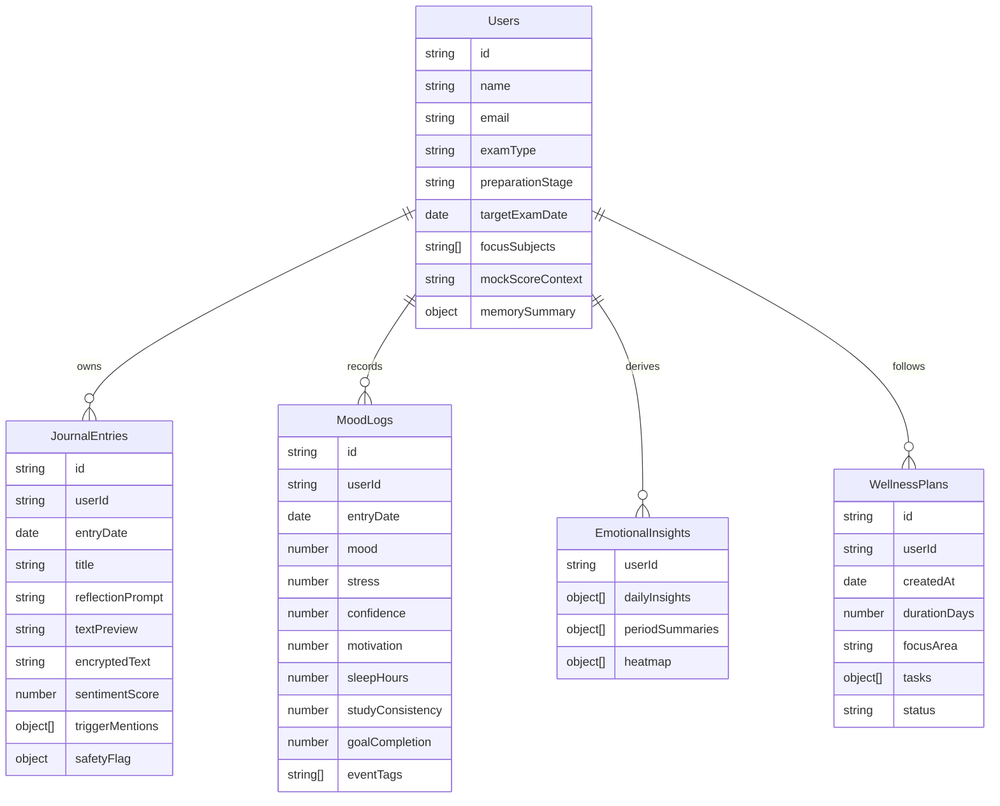

# Database Design

## ER Diagram

## Collections
### `Users`
- exam context and profile settings
- demo persona tagging
- latest longitudinal memory summary

### `JournalEntries`
- encrypted journal body
- preview text for safe UI rendering
- extracted triggers and negative thoughts
- safety metadata and sentiment score

### `MoodLogs`
- numeric emotional signals
- sleep, motivation, study consistency, goal completion
- event tags for pattern detection

### `EmotionalInsights`
- precomputed daily insight rows
- weekly and monthly trigger summaries
- burnout forecast snapshots
- heatmap cells and memory summaries

### `WellnessPlans`
- active and completed recovery plans
- task list, checkpoints, adherence, and outcomes

## Indexing Strategy
| Collection | Index | Purpose |
|---|---|---|
| `JournalEntries` | `{ userId: 1, entryDate: -1 }` | recent journal retrieval and trend windows |
| `MoodLogs` | `{ userId: 1, entryDate: -1 }` | heatmap, burnout, and motivation queries |
| `EmotionalInsights` | `{ userId: 1, "periodSummaries.periodType": 1, "periodSummaries.periodStart": -1 }` | summary retrieval |
| `WellnessPlans` | `{ userId: 1, status: 1, createdAt: -1 }` | active-plan lookup |
| `Users` | `{ examType: 1, demoPersona: 1 }` | judge demo bootstrapping |
| `RateLimits` | `{ expiresAt: 1 }` with TTL | automatic throttling cleanup |

## Schema Notes
- journal text is encrypted before persistence and never rendered as raw HTML
- `EmotionalInsights` acts as the cached analytics layer to reduce repeated recomputation
- demo personas can bypass database setup because the same snapshot model is generated deterministically in code
